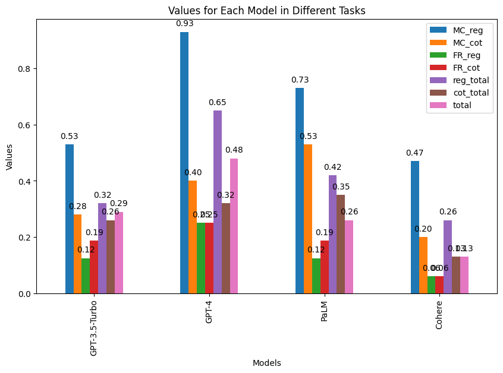
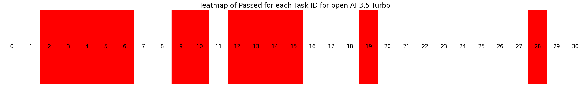
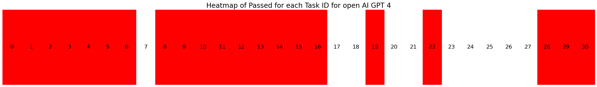
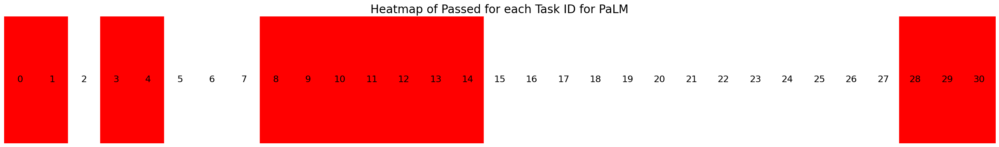
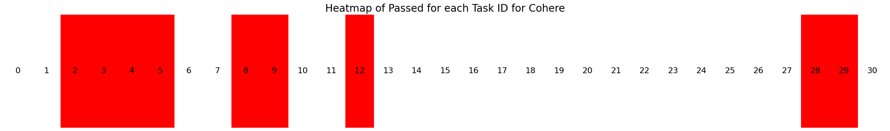

# SynBioBench
Final Project for BioE 134: [SynBioBench](https://github.com/ruohongrosellew/SynBioBench) - Synthetic Biology Benchmarking for Large Language Models
*This is a repository for the SynBioBench benchmarking suite for fundational Large Language models.*
## Table of Contents
- [SynBioBench](#synbiobench)
  - [Table of Contents](#table-of-contents)
  - [How to run](#how-to-run)
    - [Setting Up Environment](#setting-up-environment)
    - [Set up your API keys](#set-up-your-api-keys)
    - [Running the Benchmarking Tests](#running-the-benchmarking-tests)
    - [Adding Models](#adding-models)
    - [Adding Tests](#adding-tests)
  - [Benchmarking Design](#benchmarking-design)
  - [Results](#results)
  - [Limitations](#limitations)
  - [Things to improve](#things-to-improve)
  - [Author](#author)
  - [Acknowledgements and Cited Work](#acknowledgements-and-cited-work)

## How to run
### Setting Up Environment
1. Clone this repository
2. Create a virtual environment and activate it
```
python -m venv /path/to/new/venv
source /path/to/new/venv/bin/activate
```
3. Install the packages listed in **requirements.txt**
```
pip install -r requirements.txt
```
**OR**
1. Make sure you have installed miniconda in your local environment
2. Create a new conda environment and activate it
```
conda env create -f environment.yml
conda activate synbiobench
```

### Set up your API keys
After the import statements in [models_setup.py](models_setup.py), you will need to set up your API keys as environment variables.

### Running the Benchmarking Tests
In the virtual python environment/conda environment, run the following command:
`python execution.py synbioEval.jsonl`
This automatically runs the benchmarking tests and saves the results by model in csv format under results directory.
You can also replace the synbioEval.jsonl with your own jsonl file with tests.
To test if a basic benchmarking test is working, you can run the following command:
`python execution.py ./test/test.jsonl`
This will run one test benchmarking test to check if your environment has been set up correctly.

### Adding Models
This benchmarking test suite use the langchain chat models interface to call chat models and create sequential chains using the LLMs. First, check if the model is supported by Langchain, follow the instructions and pattermatch the last few lines in [models_setup.py](models_setup.py). If the model is not supported by Langchain, you can also add it to the models dictionary in the [models_setup.py](models_setup.py) file. Do not call the create_cot_chain method using a llm that is not supported by Langchain.


### Adding Tests
If you want to add any new tests, you can add them in the [synbioEval.jsonl](synbioEval.jsonl) file. Each line in the file represents a test case. Each test case has the following format:
```
{"task_id": "SynbioEval/0, this is the task id number",
 "prompt": "This is the question you want to ask the model", 
 "solution": "this is the standard soltuion to the question"}
```
You can also create your own testing suite. Provide the directory to your test files when you run [execution.py](execution.py).

## Benchmarking Design
**Keypoints** 
- Different from previous benchmarking work on LLM in the biology domain, I incorporated a significant amount of open-ended questions (with one single correct solution) to evaluate the ability fundational LLMs in synthetic biology.
- I also incorporated [CoT(Chain of Thoughts)](https://arxiv.org/abs/2205.11916) as a prompting technique to evaluate its impact on fundational LLMs' ability in the biological domain.

I designed 31 questions to test the models' knowledge of the SynBio domain. The questions are divided into 2 categories: Multiple choices questions and free response questions. The Multiple choices questions are designed to test the models' ability to recognize the correct answer to the question. The free response questions are in general more open-ended and designed to test the models' ability to follow the central dogma with the given DNA, RNA sequences.

In most of the biology/medicine related LLM benchmarking datasets, the question are mostly in multiple choices format. Indeed, this tests the domain knowledge of LLMs. However, to make LLM as a synthetic biology lab assistant. The ability to manipulate DNA, RNA, proteins sequences are essential and cannot be tested by multiple choice questions, as this task is open-ended in nature. 

For every model, I test their ability in both direct inference and using more advanced prompt engineering techniques : [Chain of Thoughts (CoT)](https://arxiv.org/abs/2205.11916)

Due to API availability, I only tested the models that I have access to: GPT 3.5 Turbo, GPT 4, PaLM 2 (Bison model) and Cohere

All of the models are tested under the chat model, to create a easy to use interface, I used [langchain](https://www.langchain.com/) to wrap up the models and create sequencial chains to implement chain of thoughts.

The benchmarking suite also support multiprocessing. To speed up the evaluation process, I create seperate processes for each model so the evaluation is parallelized. The log for each process is save in the log directory.

All the direct results from the models are save into csv files in the results directory.

## Results
| Model | MC Accuracy @ Regular| MC Accuracy @ CoT | FR Accuracy @ Regular | FR Accuracy @ CoT | Regular Accuracy | CoT Accuracy | Total Accuracy |
| ----- | --------------------- | ------------------ | --------------------- | ------------------ | ----------------- | -------------- | -------------- |
| GPT 3.5 Turbo | 0.53 | 0.28 | 0.125 | 0.1875 | 0.32| 0.26 | 0.29 |
| GPT 4 | 0.93 | 0.4 | 0.25 | 0.25| 0.65| 0.32| 0.48|
| PaLM (Bison)| 0.73| 0.53 |0.125| 0.1875 | 0.42 | 0.35 | 0.26|
| Cohere | 0.47 | 0.2 | 0.06 | 0.06 | 0.26 | 0.13| 0.13|

In term of accuracy, GPT 4 perform the best among the four model tested in this small benchmark testing suite. The accuracy of Cohere is the lowest among the four models. The accuracy of GPT 3.5 Turbo is the second best among the four models, which is similar to the accuracy of PaLM (Bison chat model), ranked third.

It is suprising that the overall accuracy of Chain of Thoughts test is less than the accuracy of regular test. In theory, with CoT, the model should be able to get the answer more accurately, especially for more complex questions like DNA reverse complement, RNA translation. From the following bar graph, we can tell the accuracy of CoT is higher than the accuracy of regular testing in free response questions (the ones that LLMs generally performed poorly). This shows that prompt engineering technique like CoT can be helpful for improving the performance of LLMs in complex tasks.



On the contrary, the accuracy of CoT is lower than the accuracy of regular testing in multiple choices questions. The common incorrect answers for CoT tests are a long explanation of the answer, which is not following the prompt where we specified answer with one letter. This could be due to the fact the context window for the model we tested are limited. The largest context window among the models we tested is 8k token. I wasn't able to identify if this is the root cause of the low accuracy of multiple choices questions under CoT as I don't have access to models that have a larger context window.

Here is a list of heat maps that shows the task completion status for each given model. Red meaning the model has at least got the answer correctly once whether it's under CoT or regular testing. 




From the heat maps, the models performed poorly from task 15 to 27. Task 15 to 27 are the tasks that involve manipulating medium to long sequences of DNA and RNA. Using CoT doesn't even improve the performance of the models on these tasks. 

## Limitations
This is a non comprehensive benchmarking test suite of the ability for large language models to perform synthetic biology tasks. The models tested in the original code is also limited as I wasn't able to get access to certain API keys from certain companies.

The test suite is also limited in the number of questions it currently has. More questions in the sysnetics biology domain will be added in the future.

One of my original plan is to also test the ability of these models if we use LLM empowered Agents in the benchmarking test. Particularly, I believe adding tools to the agents and the ability to search external resource would improve the accuracy of the open ended questions by a large margin. However, I was not entirely sure if benchmarking on the fundational model should incorporate the use of external resouces, as the aim of this project is to assess the ability of the fundational model themselves. If we need to incorporate LLMs in a autonomous synthetic biology lab, we should definitely incorporate the use of agents and the [ReAcT](https://arxiv.org/pdf/2210.03629.pdf) prompting framework.

## Things to improve

A more effective strategy of evaluating the multiple choice answers from the LLMs. This occurs in this work as well as some of the other LLM related projects. I did manually verified all the responses from the LLM. I'm thinking of a way to include this situation in the benchmark scoring system. For example, if the model explains why a certain option is the correct answer, it should not get the full score as it doesn't follow the direction of answer in one letter.

Another direction that I could investigate is how the context window length influence the ability of the model to manipulate with long DNA/RNA/protein sequences. As I wasn't able to get access to all the OpenAI models, I couldn't test this aspect by controlling all the other confounding variables than context window length.

## Author
Roselle (Ruohong) Wang - [ruohongrosellew](https://github.com/ruohongrosellew)


## Acknowledgements and Cited Work
- [Evaluating the Potential of Leading Large Language Models in Reasoning Biology Questions](https://arxiv.org/abs/2311.07582)
- [Chain-of-Thought Prompting Elicits Reasoning in Large Language Models](https://arxiv.org/abs/2201.11903)
- [Large Language Models are Zero-Shot Reasoners](https://arxiv.org/abs/2205.11916)
- [Evaluating Large Language Models Trained on Code](https://arxiv.org/abs/2107.03374)
- [A Survey of Large Language Models](https://arxiv.org/abs/2303.18223)
- [Bioinfo-Bench: A Simple Benchmark Framework for LLM Bioinformatics Skills Evaluation](https://www.biorxiv.org/content/10.1101/2023.10.18.563023v1.full)
- [LangChain](https://www.langchain.com/)
- [REACT: SYNERGIZING REASONING AND ACTING IN LANGUAGE MODELS](https://arxiv.org/pdf/2210.03629.pdf)
- [The Nucleotide Transformer: Building and Evaluating Robust Foundation Models for Human Genomics](https://www.biorxiv.org/content/10.1101/2023.01.11.523679v3.full)

Some of the multiple choices questions in the test suite are derived from the Bio 1A and BIOE 10 course at the University of California, Berkeley. 